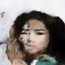
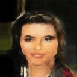
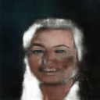
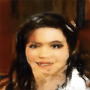

# *FaceFusion-Videos-from-Latent-Interpolations*
[](https://opensource.org/licenses/MIT)
[](https://github.com/Lizoug/FaceFusion-Videos-from-Latent-Interpolations/actions/workflows/main.yml)


[Grading PDF](./readme_assets/GutachtenLiza.pdf)

## Introduction 🚀
This project focuses on creating animations using WGANs by interpolating in the latent space. These animations take the form of smooth transitions between various generated images, resulting in GIFs that showcase the capabilities of the trained model.

<p float="left">
  
  
  
  
  
  
</p>

---

## Table of Contents 📖
1. [Introduction](#introduction-)
2. [Getting Started Locally](#getting-started-locally-)
3. [Prerequisites](#prerequisites)
4. [Setup](#setup)
5. [Installation](#installation)
6. [Running the Application](#running-the-application)

---

## Getting Started Locally 💻
Follow these steps to get the project running on your local machine.

### Prerequisites
- **Git**: Version control system
- **Anaconda**: Open-source distribution for Python/R
  - Download Anaconda [here](https://www.anaconda.com/).

### Setup 🛠️

1. **Create a Dummy Folder** on your desktop.
2. **Open Git Bash** by right-clicking on the folder and selecting "Git Bash here".
3. **Clone the Repository**: <br>
```bash
git clone https://github.com/Lizoug/FaceFusion-Videos-from-Latent-Interpolations.git`
```
4. **Close Git Bash** and open Anaconda Prompt.

### Installation 🔧

1. **Open Anaconda Prompt**.
2. **Create a New Conda Environment**: <br>
```bash
conda create --name myenv python=3.8
```
3. **Activate the New Environment**: <br>
```bash
conda activate myenv
```
4. **Navigate to the Project Directory**: <br>
```bash
cd path_to_dummy_folder/FaceFusion-Videos-from-Latent-Interpolations
```
5. **Install Requirements**: <br>
```bash
pip install -r requirements.txt
```
6. **Download Pre-Trained Models**: <br>
```bash
cd Backend
python download_model.py
```

### Running the Application 🏃🏽‍♀️
1. Navigate to the Frontend Directory <br>
```bash
cd ..
cd Frontend
```
2. Run Streamlit Application <br>
```bash
streamlit run app.py
```
