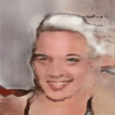
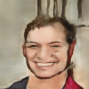

# *FaceFusion-Videos-from-Latent-Interpolations*

## Introduction 🚀
This project focuses on creating animations using generative models by interpolating in the latent space. These animations take the form of smooth transitions between various generated images, resulting in GIFs that showcase the capabilities of the trained model.

  
  
  
  
  
  

## Getting Started Locally 💻
Follow these steps to get the project running on your local machine.

### Prerequisites
- **Git**: Version control system
- **Anaconda**: Open-source distribution for Python/R
  - Download Anaconda [here](https://www.anaconda.com/).

### Setup 🛠️

1. **Create a Dummy Folder** on your desktop.
2. **Open Git Bash** by right-clicking on the folder and selecting "Git Bash here".
3. **Clone the Repository**: `git clone https://github.com/Lizoug/FaceFusion-Videos-from-Latent-Interpolations.git`
4. **Close Git Bash** and open Anaconda Prompt.

### Installation
#### 1. Open Anaconda Prompt

#### 2. Create a New Conda Environment
`conda create --name myenv python=3.8`

#### 3. Activate the New Environment
`conda activate myenv`

#### 4. Navigate to the project directory 
`cd dummy_folder/FaceFusion-Videos-from-Latent-Interpolations`

#### 5. Install Requirements
`pip install -r requirements.txt`

#### 6. Run the download_model.py script to download the pre-trained models:
`python download_model.py`

### Running the Application

#### 1. Navigate to the Frontend Directory
`cd Frontend`

#### 2. Run Streamlit Application
`streamlit run app.py`

